# 따숲(ddasoop) 개발 보고서

하루 3분, 마음이 따숲 — 육아로 지친 마음을 위한 AI 쉼 처방 웹앱

- 배포 주소: https://ddasoop.vercel.app
- 저장소: https://github.com/kwork0828/ddasoop
- 작성자 / 기간: kwork0828 / 2026년 8월

---

## 1. 어떤 문제에서 출발했는지

아이를 돌보는 하루는 잠깐 앉아 쉴 틈조차 내기 어렵습니다. 그런데 정작 힘든
순간에 필요한 것은 긴 상담이나 거창한 계획이 아니라, "지금 그 마음이 그럴
만하다"는 한마디와 5분 안에 해볼 수 있는 아주 작은 행동 하나였습니다.

그래서 따숲은 기능을 늘리는 대신 흐름을 줄이는 쪽으로 설계했습니다. 기분을
하나 고르고, 마음을 한 줄 적고, 버튼을 누르면 끝입니다. 서비스 이름은
첫째 아이의 이름 시온(始溫), 처음 시와 따뜻할 온에서 가져왔습니다.

아이 이름이나 진단명 같은 민감한 정보는 처음부터 요구하지 않고, 회원가입도
두지 않았습니다. 첫 화면에 "회원가입 없음, 서버에 저장하지 않습니다"를
먼저 보여준 것은 이 약속을 사용자가 바로 확인할 수 있게 하기 위해서입니다.

---

## 2. 개발 환경을 먼저 갖추고 시작했습니다

작업에 앞서 필요한 도구가 모두 설치되었는지 확인했습니다. Git으로 버전을
관리하고, Node.js로 배포 도구를 실행하고, Python으로 서버 함수를 작성하는
구조였기 때문입니다.

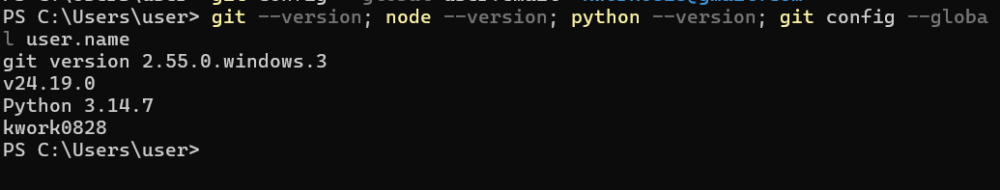

*그림 1. Git 2.55, Node.js 24.19, Python 3.14 설치 확인*

이어서 폴더 구조를 먼저 잡았습니다. 화면은 `css`와 `js`, 서버 함수는 `api`,
문서는 `docs`, 캡처는 `images`로 나누어, 파일이 늘어나도 어디에 무엇이
있는지 헷갈리지 않게 했습니다.

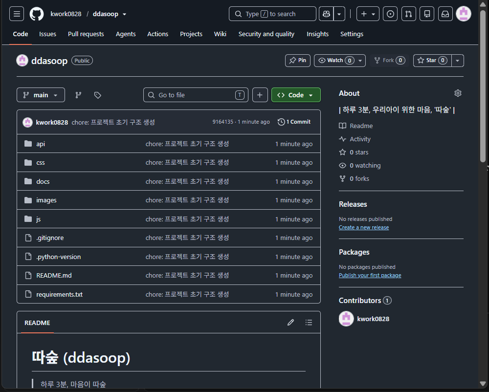

*그림 2. 역할별로 분리한 폴더 구조와 초기 커밋*

---

## 3. 구조부터 만들고 나중에 꾸몄습니다

처음에는 CSS 없이 HTML만 작성했습니다. 색과 여백을 먼저 손대면 정작 중요한
내용의 순서가 흐트러지기 쉽다고 생각했기 때문입니다. 스타일이 없는 상태에서도
제목, 안내 문구, 버튼의 순서만으로 화면이 읽히는지 확인했습니다.

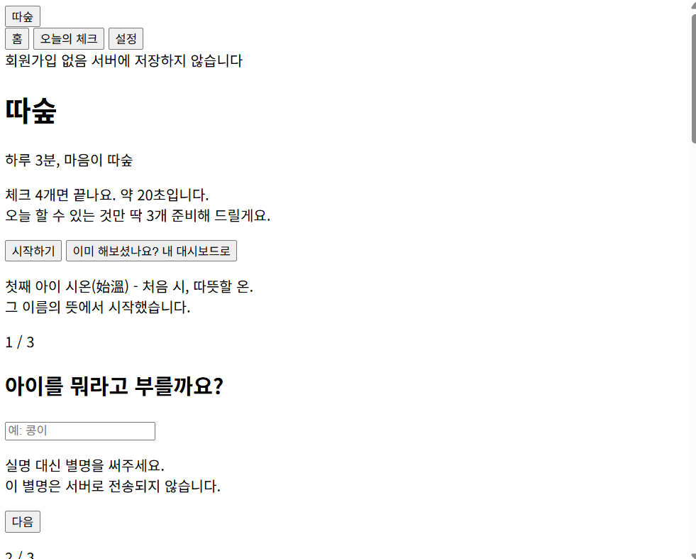

*그림 3. CSS 적용 전 — 내용의 순서와 위계만으로 읽히는지 확인*

이 구조 위에 스타일을 얹어 데스크톱과 모바일 화면을 완성했습니다.

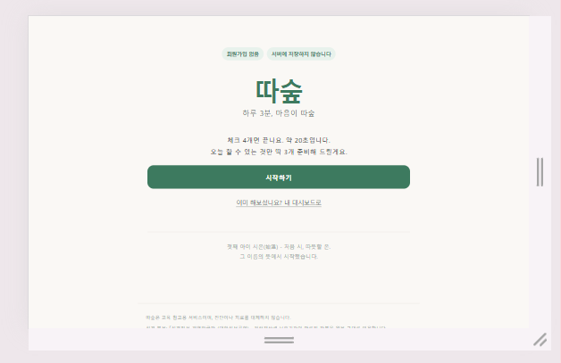

*그림 4. 데스크톱 첫 화면*

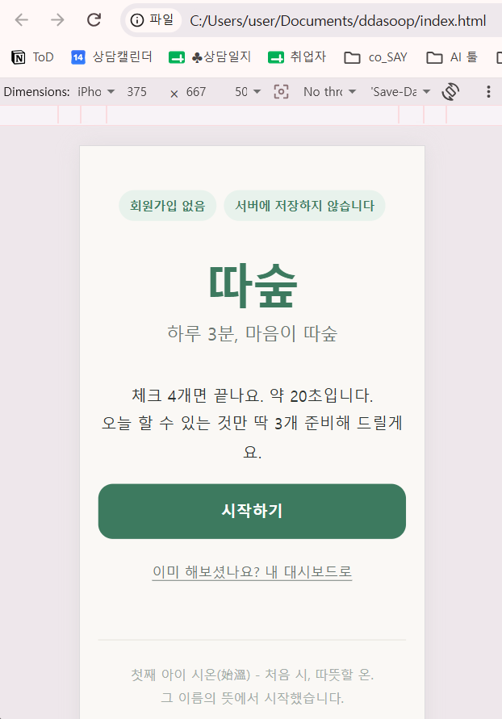

*그림 5. 375px 모바일 첫 화면 — 같은 내용이 좁은 폭에서도 온전히 보임*

---

## 4. 무엇을 만들었는지

따숲은 네 화면으로 이루어져 있습니다. 처음 방문한 사람을 위한 온보딩,
그날의 상태를 남기는 오늘의 체크, 기록이 쌓이는 대시보드, 그리고 이번 과제의
핵심인 AI 화면 마음 쉼터입니다.

대시보드는 꾸준함을 부담이 아니라 성장으로 느끼게 하려고 레벨과 새싹 그림을
넣었습니다. "작게 시작해도 괜찮아요. 이미 자라고 있어요"라는 문구를 함께 둔
것은, 하루를 빠뜨렸을 때 죄책감이 들지 않게 하기 위해서입니다.

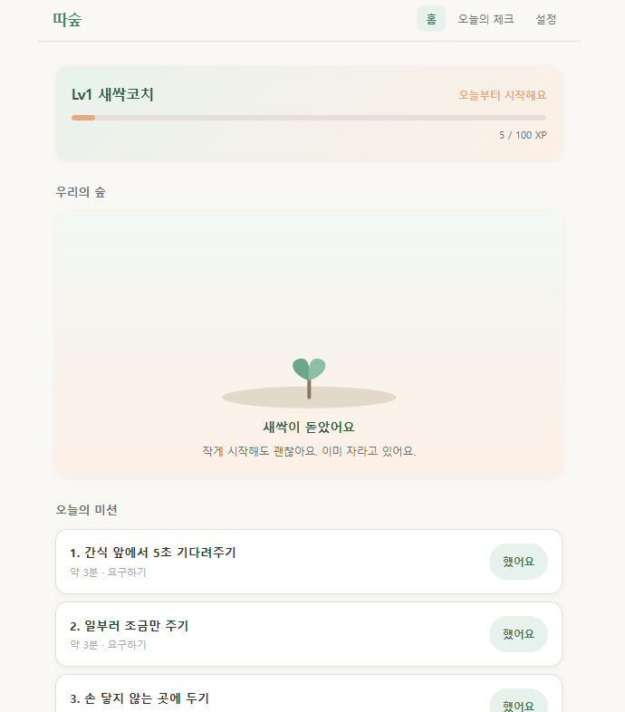

*그림 6. 대시보드 — 레벨, 성장 그래픽, 오늘의 미션 3개*

마음 쉼터는 기분 선택과 300자 제한 입력창으로 구성했습니다. 글자 수가 바로
보이도록 카운터를 두어, 길게 쓰지 않아도 된다는 신호를 주었습니다.

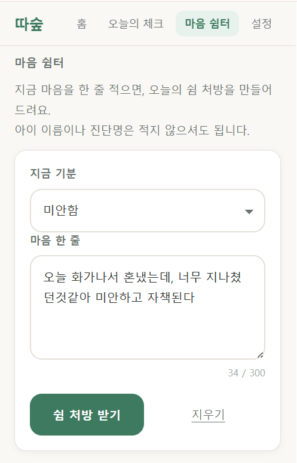

*그림 7. 마음 쉼터 입력 화면 — 기분 선택, 300자 제한, 글자 수 카운터*

버튼을 누르면 서버가 응답을 만들어 카드로 보여 줍니다. 카드는 감정을 요약한
키워드, 제목, 두 문장 이내의 공감, 점선 아래 '오늘의 한 걸음' 네 부분으로
고정했습니다. 매번 다른 형태의 글이 오면 읽는 사람이 어디에 집중해야 할지
헷갈리기 때문입니다.

---

## 5. 어떤 기술로 만들었는지

프런트엔드는 별도 프레임워크 없이 HTML, CSS, 순수 자바스크립트로 작성했습니다.
과제 범위에서 프레임워크를 얹으면 빌드 설정에 시간을 쓰게 되고, 정작 배워야 할
DOM 조작과 비동기 통신이 가려진다고 판단했습니다.

백엔드는 Vercel의 서버리스 함수로 만든 `api/generate.py` 한 개입니다. 파이썬
표준 라이브러리의 `BaseHTTPRequestHandler`로 요청을 받아, 프런트가 보낸
`mood`, `note`, `mission`을 프롬프트로 합치고 Gemini API를 호출한 뒤
`{ ok, data }` 형태로 되돌려 줍니다.

AI 모델은 Google Gemini의 flash 계열을 사용했습니다. 응답이 빠르고 무료 한도가
있어 개인 과제에 적합했습니다. 데이터 저장은 브라우저의 localStorage를
사용했습니다. 마음 기록을 서버에 남기지 않는 편이 심리적으로 더 안전하다고
보았기 때문입니다.

---

## 6. 막혔던 곳과 해결한 방법

이 과제에서 가장 많이 배운 부분은 기능을 새로 만든 순간이 아니라, 동작하지
않는 원인을 찾아간 순간들이었습니다. 세 가지를 남깁니다.

### 6-1. 사라진 모델 이름 — 404

처음 작성한 코드는 `gemini-2.0-flash`를 호출했지만 계속 실패했습니다. 화면에는
"AI 응답을 받지 못했어요"만 떠서 원인을 알 수 없었고, 그래서 서버 코드에 상태
코드와 오류 메시지를 함께 출력하는 로그를 넣었습니다. 그러자 404와 함께 이유가
드러났습니다.

모델 목록을 조회해 `gemini-2.5-flash`로 바꿨지만, 이번에는 "이 모델은 신규
사용자에게 더 이상 제공되지 않는다"는 안내가 돌아왔습니다. 결국 특정 버전을
고정하는 대신 항상 최신을 가리키는 `gemini-flash-latest`를 선택했습니다.
외부 API는 언제든 바뀌므로, 오류를 눈에 보이게 만들어 두는 일이 먼저라는 것을
배웠습니다.

### 6-2. 본문에 섞여 나온 AI의 혼잣말

모델 문제를 풀자 카드는 떴지만, 공감 문장이 있어야 할 자리에
`JSON constraint check: Valid parseable JSON...`이라는 엉뚱한 영어가
들어왔습니다.

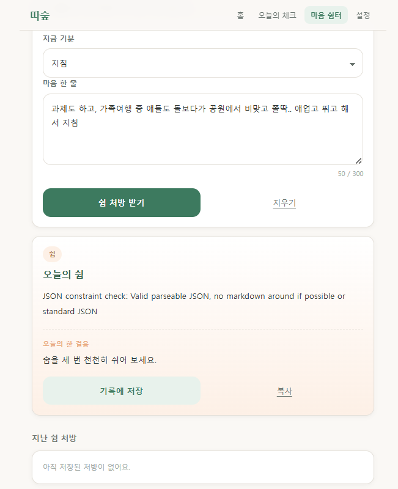

*그림 8. 본문 자리에 AI의 추론 과정이 그대로 노출된 상태*

최신 모델은 답하기 전 스스로 추론한 내용을 응답 안에 별도 조각으로 함께
담는데, 제 코드가 그 첫 조각을 그대로 본문으로 꺼내 쓴 것이 원인이었습니다.
응답을 훑으면서 추론 표시(`thought`)가 붙은 조각은 건너뛰고 실제 텍스트만
이어 붙이도록 고쳤고, 코드 블록 기호가 섞여도 JSON만 잘라내는 처리를
덧붙였습니다.

### 6-3. 20초를 넘긴 응답 — 타임아웃

그다음에는 "응답이 너무 오래 걸려요"가 떴습니다. 추론 과정 자체가 시간을
잡아먹은 것이 원인이었습니다. 짧은 공감 한마디에 깊은 추론은 필요하지 않으므로
추론 예산을 0으로 설정해 기능을 끄고, 서버 대기 시간을 45초, 프런트 대기 시간을
50초로 두었습니다. 프런트를 더 길게 잡은 이유는, 서버가 만들어 보내는 친절한
안내 문구를 사용자가 볼 수 있게 하기 위해서입니다.

세 문제를 모두 해결한 뒤, 로컬에서 처음으로 의도한 형태의 카드를 받았습니다.

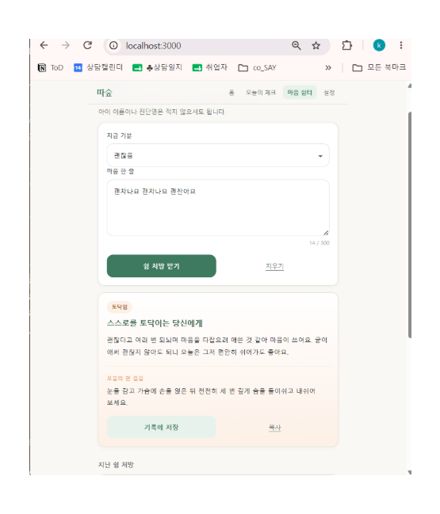

*그림 9. 세 문제 해결 후 로컬에서 받은 정상 응답*

남의 API가 돌려준 값을 무조건 신뢰하지 않고 한 겹 걸러야 한다는 점, 그리고
오류 메시지를 사람이 읽을 수 있게 남겨두면 문제 해결 속도가 크게 달라진다는
점을 체감했습니다.

---

## 7. 사용자가 실패해도 당황하지 않도록

오류 처리는 따로 신경 쓴 부분입니다. 키가 없을 때, 입력이 비었을 때, 요청이
몰렸을 때, 네트워크가 끊겼을 때, 응답이 늦을 때를 각각 다른 코드로 구분하고,
화면에는 기술 용어 대신 사람의 말로 안내했습니다. 예를 들어 요청 한도를 넘기면
"요청이 너무 많아요. 1분 뒤에 다시 시도해 주세요"처럼 다음에 무엇을 하면 되는지
까지 알려 줍니다.

AI가 형식을 어겨 JSON이 깨지는 경우에도 화면이 비지 않도록, 기본 문구를 담은
대비책을 마련해 두었습니다.

---

## 8. 반응형 — 왜 iPhone SE를 기준으로 삼았는지

이 서비스는 아이를 돌보는 중간중간 휴대폰으로 열어 보는 상황을 전제로 합니다.
그래서 데스크톱이 아니라 모바일을 기준 화면으로 잡았고, 그중에서도 현재 널리
쓰이는 기기 가운데 가로 폭이 가장 좁은 **iPhone SE(375px)** 를 기준으로
반응형 레이아웃을 최적화했습니다.

가장 까다로운 작은 화면을 먼저 통과시키면 그보다 넓은 기기에서는 자연스럽게
여유가 생기기 때문에, 다양한 기기에서 일관된 사용자 경험을 확보하는 가장
효율적인 방법이라고 판단했습니다. 실제로 이 폭에서 상단 메뉴 네 개가
줄바꿈되는 문제가 있었고, 글자 줄바꿈을 막고 여백을 조정해 한 줄에 유지되도록
수정했습니다.

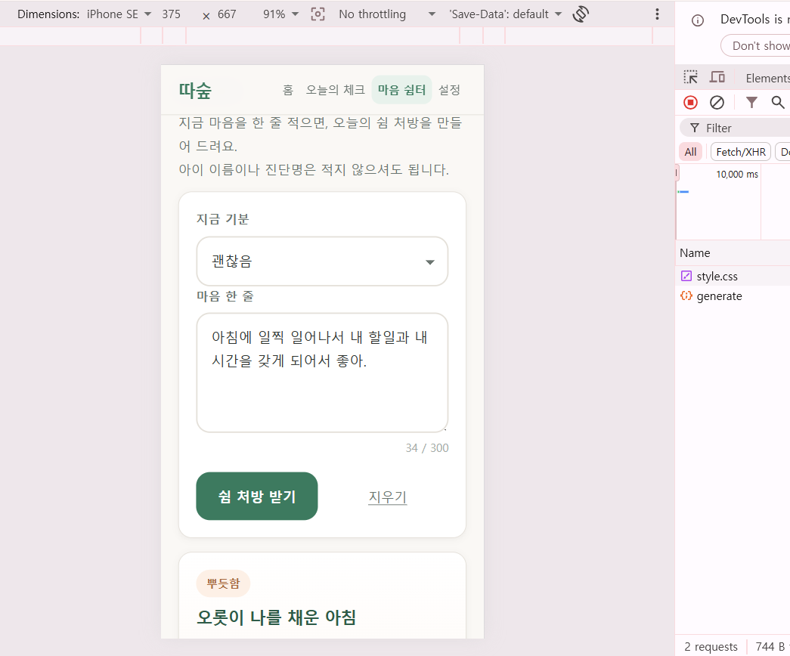

*그림 10. 375×667 환경 — 메뉴 네 개가 한 줄에 유지되고 가로 스크롤이 없음*

---

## 9. API 키를 다루며 배운 것

개발 초기에 API 키를 확인하는 과정에서 키 문자열을 그대로 노출한 적이 있었습니다.
실제 유출로 이어지지는 않았지만 즉시 키를 재발급하고 다루는 방식을 바꿨습니다.

키는 코드에 쓰지 않고 `.env` 파일에 두었으며, `.gitignore`에 등록해 저장소에
올라가지 않게 했습니다. 등록만 해두고 넘어가지 않고, 실제로 제외되는지 명령으로
직접 확인했습니다.

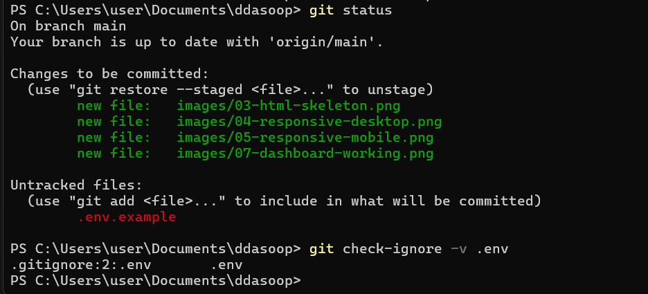

*그림 11. `.env`가 `.gitignore` 2번째 줄에 의해 제외되고 있음을 확인*

저장소에는 키 이름만 적힌 `.env.example`만 포함했습니다. 배포 환경에서는 로컬
파일이 올라가지 않으므로 Vercel의 환경 변수에 따로 등록했고, 이때 값을 다시
읽을 수 없는 Sensitive 타입을 선택해 노출 가능성을 한 번 더 줄였습니다.

확인이 필요할 때도 값을 출력하지 않고 형식이 맞는지만 검사하도록 습관을
바꿨습니다.

---

## 10. 배포

정적 파일과 파이썬 함수를 함께 올릴 수 있고 무료 한도가 있는 Vercel을
선택했습니다. 처음에는 프로젝트가 파이썬 웹앱으로 잘못 인식되어 모든 요청이
함수로 넘어가는 502 오류가 났습니다. `requirements.txt`를 `api` 폴더로 옮기고
`vercel.json`에서 프레임워크 자동 감지를 끄자 정상 동작했습니다.

또 배포 직후 배포판에서만 "서버 설정이 완료되지 않았어요"가 떴는데, 로컬의
`.env.local`은 배포되지 않는다는 점을 놓친 것이 원인이었습니다. 환경 변수를
등록한 뒤 반드시 다시 배포해야 반영된다는 점도 함께 배웠습니다.

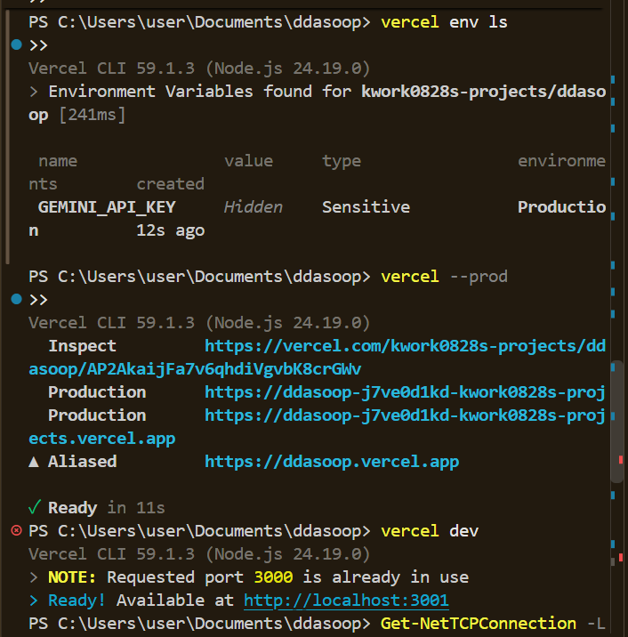

*그림 12. 키를 Sensitive 타입으로 등록한 뒤 프로덕션 재배포*

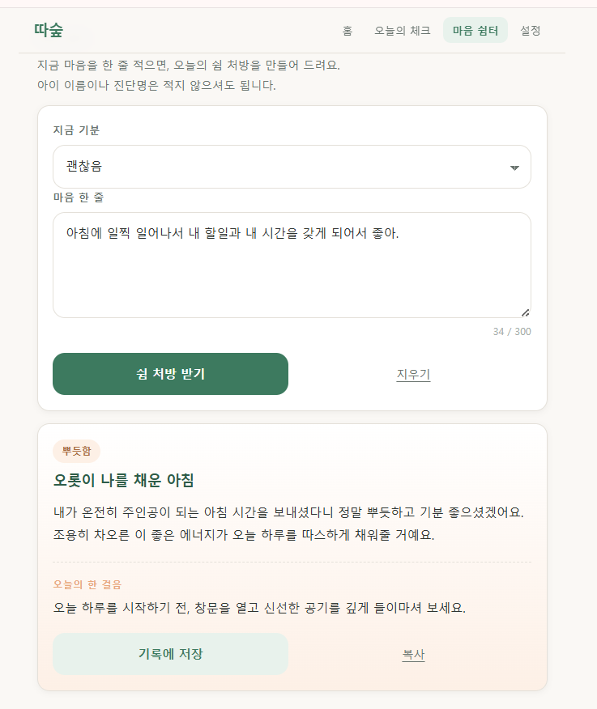

*그림 13. 배포 주소에서 정상 동작하는 쉼 처방 카드*

응답이 실제로 서버를 거쳐 오는지는 개발자 도구로 확인했습니다.

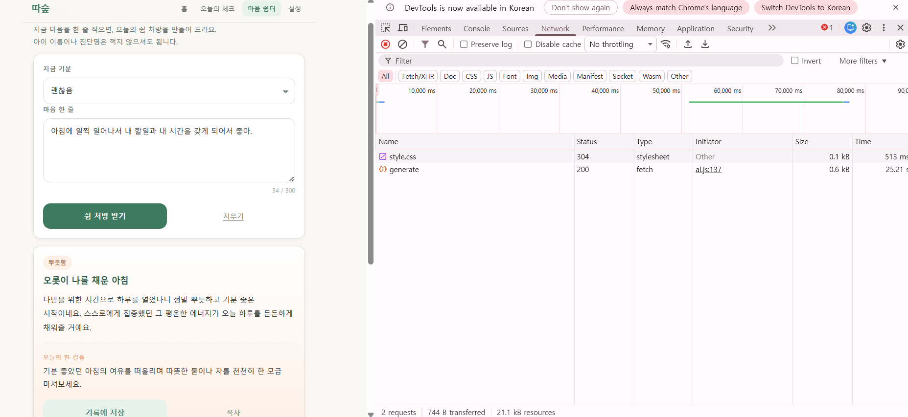

*그림 14. `/api/generate` 요청이 상태 코드 200으로 정상 응답*

---

## 11. AI 응답 품질을 어떻게 확인했는지

기능이 동작하는 것과 좋은 응답이 오는 것은 다른 문제라고 보고, 서로 다른 감정으로
나누어 확인했습니다.

한 번은 "괜차나요 괜차나요 괜찮아요"처럼 같은 말을 반복해 입력했습니다. AI는
이를 애써 괜찮은 척하는 마음으로 읽고 "굳이 애써 괜찮지 않아도 되니 오늘은 그저
편안히 쉬어가도 좋아요"라고 답했습니다. 다른 한 번은 "아침에 일찍 일어나서 내
시간을 갖게 되어서 좋아"라고 적었더니, 위로하려 들지 않고 '오롯이 나를 채운
아침'이라는 제목으로 함께 기뻐하는 톤으로 답했습니다.

판단하거나 훈계하지 말고 먼저 공감하라는 규칙, 존댓말을 쓰되 딱딱하지 않게 하라는
규칙, 의학적 진단은 하지 말라는 규칙을 프롬프트에 명시한 것이 톤에 그대로 반영된
결과로 보입니다. 프롬프트 설계가 사실상 이 서비스의 말투를 결정한다는 점이 가장
인상적이었습니다.

---

## 12. 한계와 다음에 하고 싶은 것

현재 기록은 브라우저에만 저장되므로 다른 기기에서는 이어 볼 수 없습니다. 로그인과
서버 저장을 붙이면 해결되지만, 마음 기록을 서버에 두는 일은 보안 설계를 함께
마련한 뒤에 진행하는 것이 맞다고 생각합니다.

또한 응답의 안전성을 사람이 눈으로 확인하는 수준에 머물러 있습니다. 위기 신호가
담긴 표현이 들어올 경우 AI 응답 대신 전문 상담 자원을 안내하는 장치가 필요하고,
이 부분을 다음 과제로 두고 있습니다.

기술적으로는 프롬프트를 코드에서 분리해 파일로 관리하고, 응답 형식을 자동으로
검사하는 테스트를 붙이고 싶습니다.

---

## 13. 마무리

이번 과제에서 가장 크게 남은 것은 코드 문법이 아니라, 화면에 오류 한 줄만 떴을 때
원인을 어디서 찾아야 하는지를 익힌 경험입니다. 로그를 눈에 보이게 만들고, 외부에서
온 값을 의심하고, 실패했을 때 사용자가 다음에 무엇을 하면 되는지 알려 주는 것.
이 세 가지가 동작하는 서비스와 쓸 수 있는 서비스를 가른다는 점을 배웠습니다.
